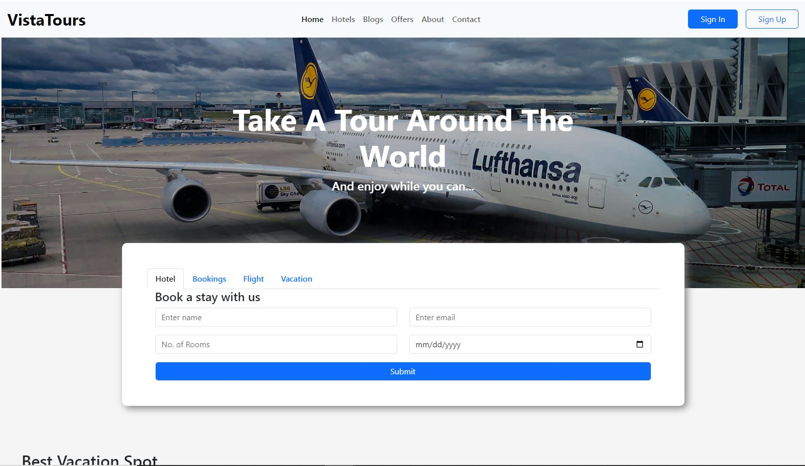

# VistaTours Website

This is a website for VistaTours company, a premier travel company dedicated to crafting unforgettable experiences for its clients. Specializing in both domestic and international travel, VistaTours offers a wide range of services including personalized tour packages, accommodation arrangements, transportation, and expert guidance to ensure seamless journeys. .

## Table of contents

- [Overview](#overview)
  - [Screenshot](#screenshot)
  - [Links](#links)
- [My process](#my-process)
  - [Built with](#built-with)
  - [Continued development](#continued-development)
- [Author](#author)

## Overview

### Screenshot

### Links

- Live Site URL: [Click to view Live site](https://vistatours.netlify.app/)

## My process

### Built with

- Semantic HTML5 markup
- CSS custom properties
- Flexbox
- Bootstrap

### Continued development

I need to learn more about CSS naming convention and how to write an understandable CSS.

## Author

- Twitter - [@OlaTunBozz](https://twitter.com/OlaTunBozz)
